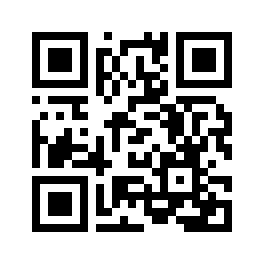

# dict

dictionary

<https://jusrin.dev/dict/>

## data

- [JMdict](https://www.edrdg.org/jmdict/j_jmdict.html) — EDRDG, CC BY-SA 4.0,
  via [jmdict-simplified](https://github.com/scriptin/jmdict-simplified).
- [CC-CEDICT](https://www.mdbg.net/chinese/dictionary?page=cc-cedict) — CC BY-SA 4.0.
- [Tatoeba](https://tatoeba.org/) sentences — CC BY 2.0 FR.
